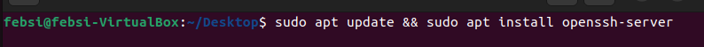

# Optimasi dan Keamanan Server Nginx di Linux: Dari Hardening hingga Load Testing

keamanan dan kinerja server web sangat penting untuk menjaga integritas dan ketersediaan layanan. Proyek ini bertujuan untuk mengoptimalkan dan mengamankan server Nginx yang berjalan di sistem operasi Linux melalui serangkaian langkah yang mencakup hardening, instalasi Nginx dengan modul Brotli, pembuatan sertifikat SSL, dan pengujian beban menggunakan alat k6.
 
### 1. Hardening linux

Hardening Linux adalah proses meningkatkan keamanan sistem operasi Linux dengan mengurangi potensi kerentanan dan mengamankan konfigurasi sistem. Dalam bagian ini, kita akan membahas langkah-langkah yang diambil untuk mengamankan server Linux, termasuk pengaturan SSH, pengelolaan pengguna, dan perlindungan terhadap serangan brute-force. Hardering yang saya lakuakn saya lakuakn adalah Passwodless, Ganti port Default untuk ssh, menonaktifkan PING, dan menggunakan Fail2ban.  

#### a. Passwordless.

1. Pertama kita buat linux mengupdate secara otomatis.
    ```bash
    sudo apt install unattended-upgardes
    sudo dpkg-reconfigure --priority=low unattended-upgardes
    ```

2. Tambahkan user dan masukan user yang sudah dibuat ke dalam user sudo.

    - Tambah user.
    ```bash
    sudo adduser <user>
    ```

    - Masukan user ke user sudo.
    ```bash
    sudo usermod -aG sudo <user>
    ```

    - Tukar user.
    ```bash
    sudo su - febri
    ```

3. Setalah melakukan otomatisa update pada serever baru kitamembuat  posswordless.

    - Kita masuk ke file ~/.ssh pada linux dan kita buat izin 700 dimana cuman hanya pemilik direktori yang dapat mengaksesnya.
    ```bash
     cd ~/.ssh
     sudo chmod 700 ~/.ssh
    ```

    - Setelah itu kita create publik/privet key pada komputer yang ingin mengakses linux server kita dengan ssh dengan perintah.
    ```bash
    ssh-keygen -b 4096
    ```
    Dapat kita lihat bahwa public key dan privet key sudah dibuat.
    
    

    Dapat kita lihat pada folder ~/.ssh sudah terdapat file id_rsa(privet key) dan id_rsa.pub(public key).

    - Uplaoud file public key ke dalam linux server dengan perintah.
    ```bash
    scp $env:USERPROFILE/.ssh/id_rsa.pub <user@ip ubuntu>:~/ssh/authorized_keys
    ```
    

    Kita coba ssh dari komputer kita.

    

#### b. Ganti Port DEfault.

1. Buka file sshd_config dengan perintah.
    ```bash
    sudo nano /etc/ssh/sshd_config
    ```

    Ubah configurasi sesuai dengan gambar dibawah


2. Restart ssh server nya dengan perintah.
    ```bash
    sudo systemctl restart sshd
    ```

3. Kita coba mengakses ssh nya dengan perintah yang sama.


Pasti tidak bisa sebab port yang kita gunakan sudah kita ganti.

4. Kita coba dengan dengan menambahkan port yang sudah kita masukan kedalam konfigurasi. sebelum itu pastikan firewall menngizinkan koneksi port yang diatur dengan perintah.

    ```bash 
    sudo ufw allow 717/tcp
    ```


Setalh itu baru buka ssh dengan port yang ditentukan.


#### c. nftables
nftables adalah framework atau sistem firewall yang moderen di linux. dengan ini kita bisa mengatur aturan untuk memfilter, memodifikasi, dan memantau paket jaringan dengan cara yang lebih sederhana dan konsisten dan efisien.

kita gunakan nftables untuk alran port yang akan kita izinkan seperti , port 80 (untuk nginx) ,port 443 (untuk ssl) dan port 717 (untuk ssh). yang dikerjakan disini cukan drop dan accept portnya.

alur kerjanya:
- paket data masuk ke interface jaringan server kita.
- paket melewati hook tertentu di kernel, mis:
    - input -> paket masuk ke host lokal
    - forward -> paket diteruskan ke jaringanlain
    - output -> paket keluar dari host
- nftable menggunak tabel dan chain:
    - table -> kumpulan aturan (mis filter, nat)
    - chain -> jalur logika di dalam table (mis. input, forward, output)
- paket dibandingkan dengan aturan rules di chain:
    - accept (port memberikan izin untuk di lalui)
    - drop (port tidak dikasih izin diakses)
- karnel mengeksekusi aksi yang ditentukan oleh rule
- paket diteruskan atau dikirim sesuai hasil aturan yang berlaku.

untuk menggunakan nftables dapat kita lakukan langkah berikut.

- install nftables:
    ```bash
    sudo install apt nftables 
    ```

- enable atau start nftables:
    ```bash
    sudo systemctl start nftables
    ```

- tambahkan command line pada file /etc/nftables.conf:

    ```bash
    #!/usr/sbin/nft -f

    flush ruleset

    table inet filter {
        chain input {
            type filter hook input priority 0;

            tcp dport 80 accept

            tcp dport 443 accept

            tcp dport 717 accept
        
        }
        chain forward {
                type filter hook forward priority 0;
        }
        chain output {
                type filter hook output priority 0;
        }
        }
    ```
- reload nftables: 
    
    ```bash
    sudo nft -f /etc/nftables.conf
    ```

- cek nftables yang sudah dibuat:

    ```bash
    sudo nft list ruleset
    ```

#### d. Fail2ban
Fail2ban adalah software yang menggunakan bahasa  pyhton untuk melindungi sistem kita dari serangan brute-force. berikut cara pengunaan fail2ban di linux ubuntu.

- Instal fail2band dengan perintah.
    ```bash 
    sudo apt install fail2ban
    ```

- Setelah itu jalankan fail2ban dan lihat statusnya dengan perintah.
    ```bash
    sudo systemctl start fail2ban
    sudo systemctl status fail2ban
    ```

    

- Setelah itu kita aktifkan fail2ban agar otomatis running meski sistem kita mengalami restart atau reboot.
    ```bash
    sudo systemctl enable fail2ban
    ```

- Copy file jail.conf 
    ```bash
    sudo cp /etc/fail2ban/jail.conf /etc/fail2ban/jail.local
    ```

- Setelah itu kita configurasi pada jail.conf.
    ```bash
    sudo nano /etc/fail2ban/jail.local
    ```

    Pada bagian ssh tambahkan command

    ```bash
    enable  = true // aktifkan fail2ban
    findtime = 10m //waktu lama nya untuk melakukan login
    maxretry = 4 //batas mencoba 
    bandtime = 2h //waktu ban ip yang mencoba paksa masuk
    ```
- Setelah itu kita uji konfigurasi fail2ban yang sudah di buat valid atau tidak dengan perintah.
    ```bash 
    sudo fail2ban-client -d
    ```

- Restart fail2ban dan lihat status.
    ```bash 
    sudo systemctl restart fail2ban
    sudo systemctl status fail2ban
    ```


- Kita cek status status konfigurasi yang dikerjaan oleh fail2ban
    ```bash
    sudo fail2ban-client status
    ```


Uji coba fail2ban pada sshd yang sudah kita atur. Dengan cara memasukan user yang salah tapi dengan ip dan port yang sama.


Lihat statsu fail2ban.


### 2. Install Nginx dengan module Brotil

Nginx adalah server web yang populer dan efisien. Dalam bagian ini, kita menginstal Nginx dan menambahkan modul Brotli untuk meningkatkan kompresi konten, yang dapat mempercepat waktu muat halaman dan mengurangi penggunaan bandwidth. Proses ini mencakup pengunduhan, kompilasi, dan konfigurasi Nginx untuk memanfaatkan modul Brotli.

1. Install Dependencies"

    ```bash
    sudo apt-get install dpkg-dev build-essential gnupg2 git gcc cmake libpcre3 libpcre3-dev zlib1g zlib1g-dev openssl libssl-dev curl unzip libbrotli-dev -y
    ```

2. tambahkan Reposittory Nginx

    ```bash
    sudo curl -L https://nginx.org/keys/nginx_signing.key | sudo apt-key add -
    ```

    buat file /etc/apt/sources.list.d/nginx.list:

    ```bash
    deb http://nginx.org/packages/ubuntu/ noble nginx
    deb-src http://nginx.org/packages/ubuntu/ noble nginx
    ```

    lalu update repository nya:

    ``bash 
    sudo apt-get update -y
    ```

3. persiapkan module brotli:

    ```bash
    cd /usr/local/src
    sudo apt-get source nginx
    ```

    install depedencies tambahan
    ```bash
    sudo apt-get pkg-dev build-essential
    ```

    download module brotli dari github:
    ```bash
    sudo git clone --recursive https://github.com/google/ngx_brotli.git
    ```

4. konfigurasi buid nginx.
    
    ```bash
    cd /usr/local/src/nginx-1.28.0/debian/rules
    ```

    tambahkan command pada bagian config.status.nginx dan config.status.nginx_debug pada barisan setelah /.configure:

    ```bash
    --add-module=/usr/local/src/ngx_brotli
    ```

5. Compile dan build nginx

    ```bash
    sudo dpgk-buildpackage -b -uc -us
    ```

    cek hasil package:
    ```bash
    ls /usr/local/src/*.deb
    ```

    hasil:
    ```bash
    /usr/local/src/nginx_1.28.0-1~noble_amd64.deb
    /usr/local/src/nginx-dbg_1.28.0-1~noble_amd64.deb
    ```

    install nginx:
    ```bash 
    sudo dpkg -i /user/local/serc/*.deb
    ```

6. konfigurasi modul brotli:

    ```bash
    sudo nano /etc/nginx/nginx.conf
    ```

    tambahkan command line pada bagian http{}:
    ```bash
    brotli on;
    brotli_comp_level 6;
    brotli_static on;
    brotli_types text/plain text/css application/javascript application/x-javascript text/xml application/xml application/xml+rss text/javascript image/x-icon image/vnd.microsoft.icon image/bmp image/svg+xml;
    ```

    cek sintaks nginx:
    ```bash
    sudo nginx -t
    ```

    hidupkan nginx:
    ```bash
    sudo systemctl start nginx
    ```

7. buat self-signed SSL

    ```bash
    sudo openssl req -x509 -nodes -days 3652 -newkey rsa:2048 -keyout /etc/ssl/private/localhost.key -out /etc/ssl/certs/localhost.crt
    ```

8. konfigurasi nginx untuk ssl

    ```bash
    sudo nano /etc/nginx/conf.d/default.conf
    ```

    tambahkan command line bapada blok server:
    ```bash
    server {
              listen       80;
              listen       [::]:80;
              server_name  _;
              root         /usr/share/nginx/html;

              index index.html index.htm;

              location / {
              try_files $uri $uri/ =404;
          }
          }
          server {
              listen 443 ssl;
              server_name localhost;

              ssl_certificate /etc/ssl/certs/localhost.crt;
              ssl_certificate_key /etc/ssl/private/localhost.key;

              root /usr/share/nginx/html;
              index feb.html;
          }
    ```

    cek sintaks: 
    ```bash
    sudo nginx -t
    ```

    reload nginx:
    ```bash
    sudo systemctl reload nginx
    ```

9. Verifikasi Brotli dan ssl berhasil atau tidak.
    ```bash
    curl -H "Accept-Encoding: br" -I http://localhost
    ```
    

    pengujian brotli pada nginx.

    

- Kita lihat tampilan web yang sudah kita buat.
    

    dapat kita lihat bahwa ssl berhasil kita tambahkan.

### 4. Load Testing dengan K6

Setelah server dikonfigurasi dan dioptimalkan, penting untuk menguji kinerjanya di bawah beban. Dengan menggunakan alat k6, kita dapat mensimulasikan banyak pengguna virtual yang mengakses server secara bersamaan. Pengujian ini membantu kita memahami bagaimana server menangani permintaan tinggi dan mengidentifikasi potensi masalah kinerja.

- Update server danInstal K6 dengan perintah 
    ```bash
     sudo apt update
     sudo apt install k6
    ```

- Buat direktori k6 dan buat file baru untuk konfigurasi k6.
    ```bash
     mkdir k6
     sudo nano <nama_file>.js
     ```

- Run file k6 yang sudah kita buat dengan perintah.
    ```bash
     k6 run <nama_file>.js
    ```
    

Kita coba web yang sudah kita buat dengam 100 virtual user yang masuk ke web kita dengan duration 40 detik dan kita lihat usage pada server kita dengan perintah.
    ```bash 
    k6 run --vus 100 --duration 40s main.js
    ```


Dapat kita lihat usage resorce yang terjadi saat load testing yang dilakukan k6.


Inilah hasil dari log load test dari k6.


