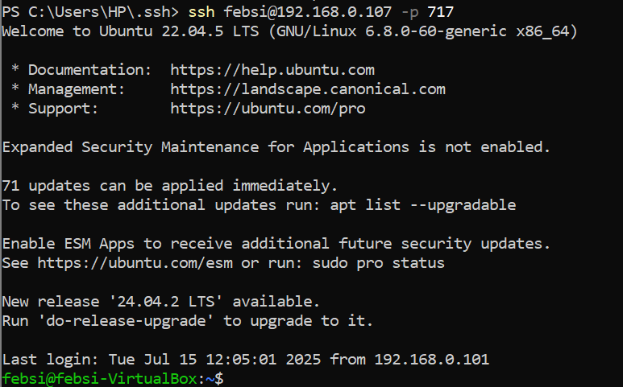
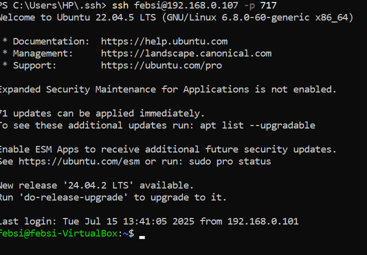
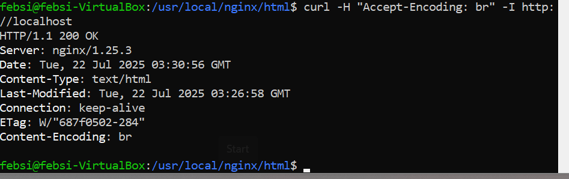
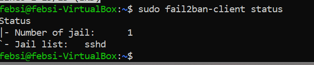
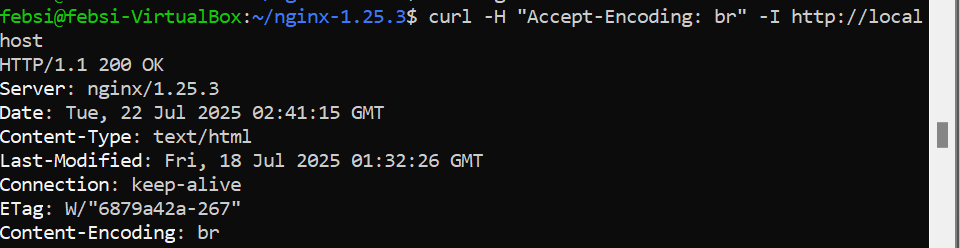
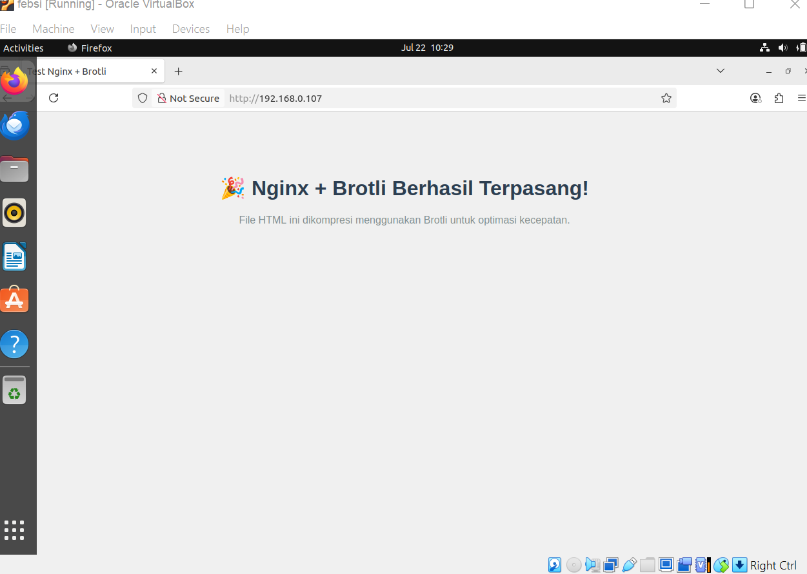
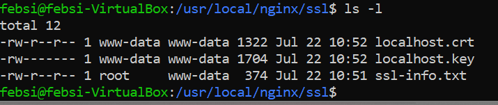
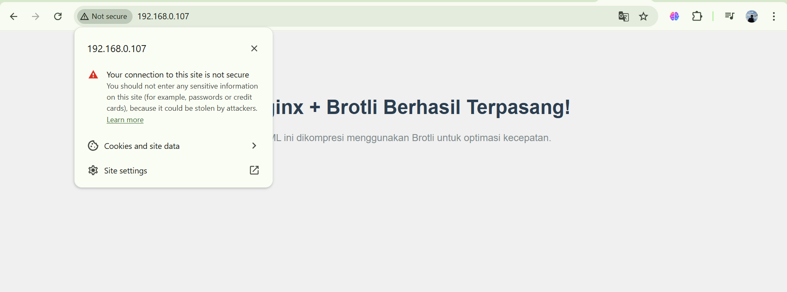

# Hardering linux dan instal nginx denagn module brotil

## 1. SSH pake passwordless, ganti port default, hardening, bila perlu coba test dan tambahakan Fail2ban

### passwordless.

1. kita membuat linux mengupdate secara otomatis.
    ```bash
    sudo apt install unattended-upgardes
    ```


2. tambahkan user dan masukan user yang sudah dibuat ke dalam user sudo.

- tambah user.
    ```bash
    sudo adduser <user>
    ```

    
- masukan user ke user sudo.
    ```bash
    sudo usermod -aG sudo febri
    ```


- tukar user.
    ```bash
    sudo su - febri
    ```

3. Setalh itu kita buat posswordless agar saat kita melakukan ssh dari kompuer yang lain kita hanya tinggal memasukan user dan ip linux tanpa perlu memasukan password saat melakukan ssh.

- kita masuk ke file ~/.ssh pada linux dan kita masukan izin 700 dimana cuman hanya pemilik direktori yang dapat mengaksesnya.
    ```bash
    sudo chmod 700 ~/.ssh
    ```


- setelah itu kita create publik/privet key pada komputer yang ingin mengakses linux server kita dengan ssh dengan perintah.
    ```bash
    ssh-keygen -b 4096
    ```


 Dapat kita lihat hasinya di gambar ini.


dapat kita lihat pada folder ~/.ssh sudah terdapr file id_rsa(privet key) dan id_rsa.pub(public key).

- uplaoud file public key ke dalam linux server dengan perintah.
    ```bash
    scp $env:USERPROFILE/.ssh/id_rsa.pub <user@ip ubuntu>:~/ssh/authorized_keys
    ```


kita coba ssh dari komputer kita.


### Ganti Port DEfault.

1. buka file sshd_config dengan perintah.
    ```bash
    sudo nano /etc/ssh/sshd_config
    ```
    ubah configurasi sesuai dengan gambar dibawah


2. Restart ssh server nya dengan perintah.
    ```bash
    sudo systemctl restart sshd
    ```

3. kita coba mengakses ssh nya dengan perintah yang sama.


pasti tidak bisa sebab port yang kita gunakan sudah kita ganti.

4. kita coba dengan dengan menambahkan port yang sudah kita masukan kedalam konfigurasi. sebelum itu pastikan firewall menngizinkan koneksi port yang diatur dengan perintah.
    ```bash 
    sudo ufw allow 717/tcp
    ```


setalh itu baru buka ssh dengan port yang ditentukan.



kita buat ip addres kita tidak bisa di ping dari server lain.
- buka file /etc/ufw/before.rules setelah itu tambah commandi pada bagian icmp INPUT dengan peintah.

    ```bash
    sudo nano /etc/ufw/before.rules
    ```
    
    tambahkan
    ```bash
    -A ufw-before-input -p icmp --icmp-type echo-request -j DROP
    ```
    reload
    ```bash
    sudo ufw reload
    ```

    ping ip server linux dari server lain.
    

akan tetapi saat server masih dapat melakukan ssh.


### Fail2ban
Fail 2ban adalah software yang menggunakan bahasa  pyhton untuk melindungi sistem kita dari serangan brute-force. berikut cara pengunaan fail2ban di linux ubuntu.

- instal fail2band dengan perintah.
    ```bash 
    sudo apt install fail2ban
    ```

- setelah itu jalankan fail2ban dan lihat statusnya dengan perintah.
    ```bash
    sudo systemctl start fail2ban
    sudo systemctl status fail2ban
    ```


- setelah itu kita aktifkan fail2ban agar otomatis running meski sistem kita mengalami restart atau reboot.
    ```bash
    sudo systemctl enable fail2ban
    ```

- copy file jail.conf 
    ```bash
    sudo cp /etc/fail2ban/jail.conf /etc/fail2ban/jail.local
    ```

- setelah itu kita configurasi pada jail.conf.
    ```bash
    sudo nano /etc/fail2ban/jail.local
    ```

    pada bagian ssh tambahkan command

    ```bash
    enable  = true // aktifkan fail2ban
    findtime = 10m //waktu lama nya untuk melakukan login
    maxretry = 4 //batas mencoba 
    bandtime = 2h //waktu ban ip yang mencoba paksa masuk
    ```
- setelah itu kita uji konfigurasi fail2ban yang sudah kita buat falid atau tidak dengan perintah.
    ```bash 
    sudo fail2ban-client -d
    ```

- setelah itu kita restart fail2ban dan lihat status.
    ```bash 
    sudo systemctl restart fail2ban
    sudo systemctl status fail2ban
    ```


- kita cek status status konfigurasi yang dikerjaan oleh fail2ban
    ```bash
    sudo fail2ban-client status
    ```


- kita lihat status sshd pada fail2ban.




## 2. Install Nginx dengan module Brotil

1. Update server kita dan install depedensi yang diperlukan.
    ```bash
    sudo apt update
    sudo apt install -y build-essential libpcre3 libpcre3-dev zlib1g zlib1g-dev libssl-dev wget
    ```

2. unduh Source code nginx.
    ```bash
    wget https://nginx.org/download/nginx-1.25.3.tar.gz
    ```

3. ekstrak File Source Code
    ```bash
     tar -xvzf nginx-1.25.3.tar.gz
     cd nginx-1.25.3
    ```

4. lakukan konfigurasi dan komplikasi.
    ```bash
      ./configure --prefix=/usr/local/nginx --with-http_ssl_modul --with-http_gzip_static_module
    ```

    kompilasi dan instal.
    ```bash
     make
     sudomake install
    ```

5. tambahkan Nginx ke PATH
    ```bash
     echo 'export PATH=/usr/local/nginx/sbin:$PATH' >> ~/.bashrc
     source ~/.bashrc
    ```

6. setelah itu cek konfigurasi.
    ```bash
     sudo nginx -t
    ```

7. menambahkan module brotil.
    ```bash
    sudo git clone https://github.com/google/ngx_brotli.git
    cd ngx_brotli
    sudo git submodule update --init
    cd ..
    ```

8. konfigurasi ulang nginx dengan modul Brotli.
    ```bash
     ./configure --prefix=/usr/local/nginx -with-http_ssl_module -with-http_realip_module  --add-module=./ngx_brotli
    ```

9. kompilasi dan install.
    ```bash
     make 
     sudo make install
    ```

10. konfigurasi nginx untuk menggunakan brotli.
    ```bash
    sudo nano /usr/local/nginx/conf/nginx.conf
    ```

    tambahkan konfigurasi berikut pada blok 'http'.
    ```bash
    brotli on;
    brotli_comp_level 6; 
    brotli_types text/plain text/css application/javascript application/json application/x-javascript text/xml application/xml application/xml+rss text/javascript;
    ```

11. restart nginx
    ```bash
    sudo nginx -s reload
    ```

12. verifikasi Brotli berhasil atau tidak.
    ```bash
    curl -H "Accept-Encoding: br" -I http://localhost
    ```
    

    pengujian brotli pada nginx.

- buat direktori web.
    ```bash
     sudo mkdir -p /usr/local/nginx/html
     cd /usr/local/nginx/html
     sudo nano index.html
    ```
 

- verifikasi brotli.
    ```bash
     curl -H "Accept-Encoding: br" -I http://localhost
    ```
    
    brotli berhasil mengkompresi file html.

## 3 buat ssl certificate dengan self signed.

- kita buat SSL directory.
    ```bash
     cd /usr/local/nginx
     sudo mkdir SSL
    ```

- buat file infoemasi tentang SSL
    ```bash
     sudo nano self-info.txt
     [req]
     default_bits       = 2048
     prompt      = no
     default_keyfile    = localhost.key
     distinguished_name = dn
     req_extensions     = req_ext
     x509_extensions    = v3_ca

     [ dn ]
     C = PH
     ST = NCR
     L = Manila
     O = localhost
     OU = Development
     CN = localhost

     [req_ext]
     subjectAltName = @alt_names

     [v3_ca]
     subjectAltName = @alt_names

     [alt_names]
     DNS.1   = localhost
     DNS.2   = 127.0.0.1
    ```

- jalankan petintah OpenSSl.
    ```bash 
     sudo openssl req -x509 -nodes -days 3652 -new key rsa:2048 -keyout localhost.key -out localhost.crt -config ssl-info.txt
    ```

    cek direktori ssl.
    


- buka konfigurasi nginx dan tambahkan printah beriku pada bagian server.
    ```bash
     sudo nano /usr/local/nginx/conf/nginx.conf

     listen 443 ssl;
     listen [::]:443 ssl;

     ssl_certificate /usr/local/nginx/ssl/localhost.crt;
     ssl_certificate_key /usr/local/nginx/ssl/localhost.key;

     ssl_protocols TLSv1.2 TLSv1.1 TLSv1;
     ```

- kita izinkan port 80 dan 443 melalui firewall agar dapat diakses oleh  server.
    ```bash
     sudo ufw allow 80
     sudo ufw allow 443
    ```

- setelah itu restar nginx dengan perintah.
    ```bash
     sudo systemctl reload nginx
    ```

- kita lihat tampilan web yang sudah kita buat.
    

    dapat kita lihat bahwa ssl berhasil kita tambahkan.

3. Instal Nginx sama module brotil(compile buka pake apt), terus coba test setup simple aplikasi, terus buat ssl certs nya pake yang self-signed juga gpp, terus kalau udah nanti coba load test pake k6s atau locus, atau apalah bebas buat mastiin konfigurasi mu udah ok atau blm, pastiin config nginx nya  juga udah well-turned.


