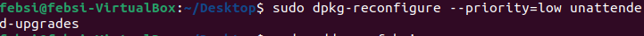
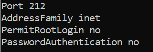
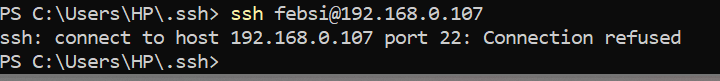
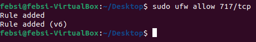
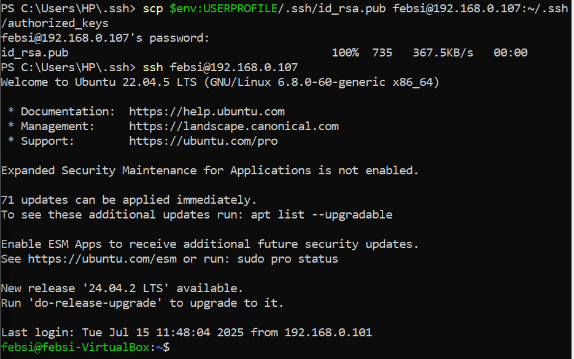

# Nginx

Setup linux di Virtual Box.

### SSH pake passwordless, ganti port default, hardening, bila perlu coba test

<h3>passwordless<h3>.

1. kita membuat linux mengupdate secara otomatis.
    ```bash
    sudo apt install unattended-upgardes
    ```




2. tambahkan user dan masukan user yang sudah dibuat ke dalam user sudo.

- tambah user.
    ```bash
    sudo adduser <user>
    ```

    
- masukan user ke user sudo.
    ```bash
    sudo usermod -aG sudo febri
    ```



- tukar user.
    ```bash
    sudo su - febri
    ```

3. Setalh itu kita buat posswordless agar saat kita melakukan ssh dari kompuer yang lain kita hanya tinggal memasukan user dan ip linux tanpa perlu memasukan password saat melakukan ssh.

- kita masuk ke file ~/.ssh pada linux dan kita masukan izin 700 dimana cuman hanya pemilik direktori yang dapat mengaksesnya.
    ```bash
    sudo chmod 700 ~/.ssh
    ```


- setelah itu kita create publik/privet key pada komputer yang ingin mengakses linux server kita dengan ssh dengan perintah.
    ```bash
    ssh-keygen -b 4096
    ```


 Dapat kita lihat hasinya di gambar ini.


dapat kita lihat pada folder ~/.ssh sudah terdapr file id_rsa(privet key) dan id_rsa.pub(public key).

- uplaoud file public key ke dalam linux server dengan perintah.
    ```bash
    scp $env:USERPROFILE/.ssh/id_rsa.pub <user@ip ubuntu>:~/ssh/authorized_keys
    ```


kita coba ssh dari komputer kita.




3. Instal Nginx sama module brotil(compile buka pake apt), terus coba test setup simple aplikasi, terus buat ssl certs nya pake yang self-signed juga gpp, terus kalau udah nanti coba load test pake k6s atau locus, atau apalah bebas buat mastiin konfigurasi mu udah ok atau blm, pastiin config nginx nya  juga udah well-turned.

 fasfasasfdasfa
